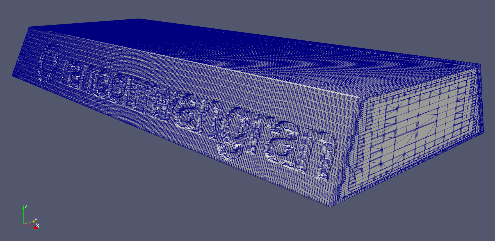
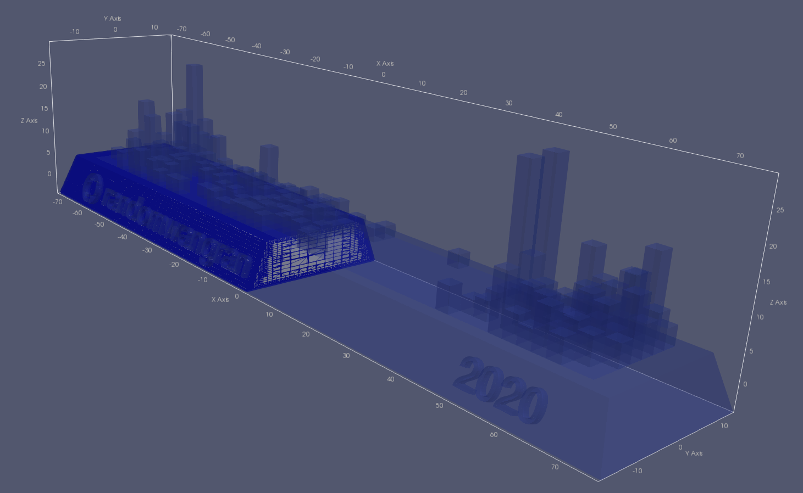

#### If the commit is a rock, what it looks like when air blows it?
I've say snappyHexMesh is smart! It kinda know what I was asking for.
This is just the 1st shot and I should be grateful no error throw out
right way.

As you can see, I need the air around my "commit rock" to be meshed
but not the "commit rock" itself.

Second, only the basement of my commitment are meshed.

Third, too much computation.

    Layer mesh : cells:864806  faces:2848196  points:1120129

#### If the commit is a bulk of water, what it looks like when a sonar scans it?
#### If the commit is a bridge, what it looks like when a force applies to it?
#### If the commit is a mountain, what it sounds like when you make noise from 7 meters away?
#### If the wind attacks from the top/right/left, what is a drag coefficient ?
#### If you throw this thing into the sky, what is the trajectory looks like?
#### If a bullet attacks it, what it looks like?
