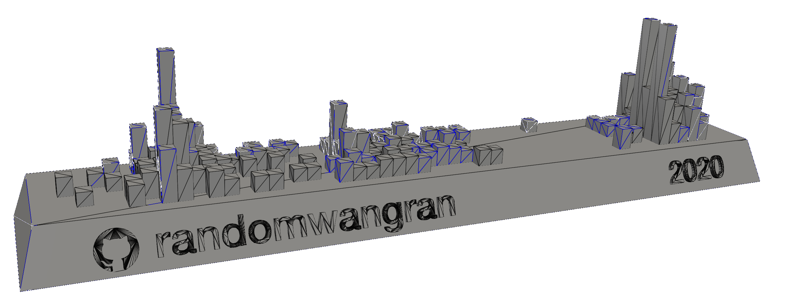

# If the commits are rocks, what it looks like when air blows it?
# If the commit is a bulk of water, what it looks like when a sonar scanner it?
# If the commit is a bridge, what it looks like when forces exerting on it?
# If the commit is a rock, what it sounds like when you speaking loud from 5 meter away?
